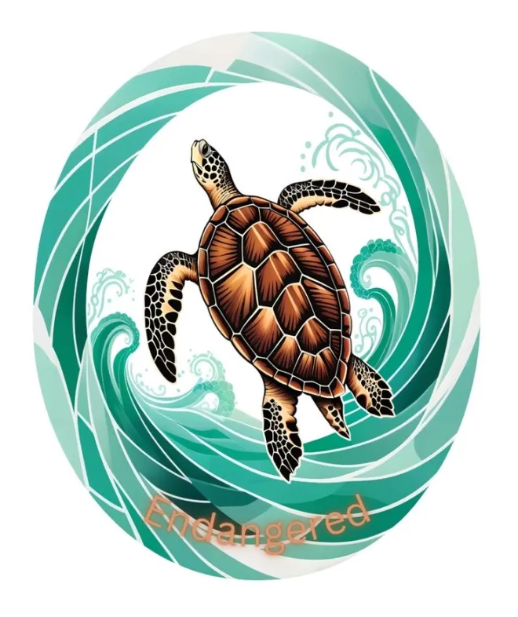
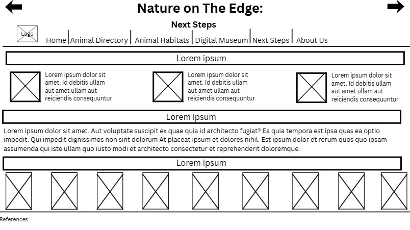
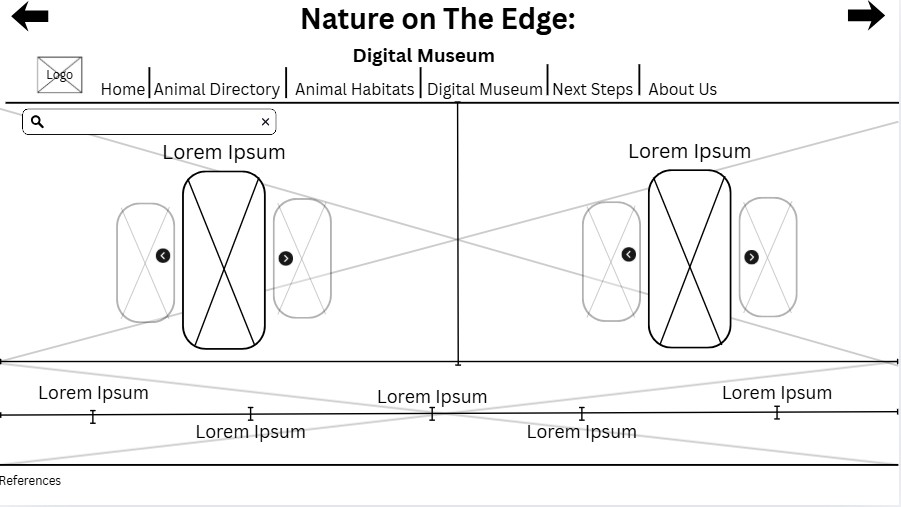
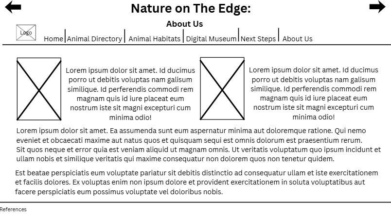

# Project Details | Evan Catriz, Himig Labastilla | 9-Cesium
## Title & Subtitle: Nature on the edge: A complete guide to the endangered species of the Philippines

## Description of the Website
This webpage aims to bring more information to the top five most endangered species in the Philippine Islands. It also helps bring light to the challenges they face when it comes to thriving in the ecosystem (internal or external) and also how we are their main hope when it comes to survival. We used this topic because it is really interesting to us and since endangered species need to be more recognized as these contribute to the diversity of the ecosystem of the Philippines. This webpage hopes to spread more awareness about the current situation of some of our native species on the brink of extinction and to help or support organizations that focus on taking care of these endangered species, and that there is more to this problem than just their forever disappearance.

## Javascript Usage on Website
Interactive Map:  
In our website, we will use an interactive map as our directory to each of the endangered species, with points in their general location. We will use Javascript to make it so that when you click on the buttons, a small in-web "window" will pop up containing a photo and some general and short information on the species with a smooth "enlarge" appearance, and will smoothly zoom out when closed. There will also be a button that says "Read more" at the bottom which, when clicked, will direct them to the actual content with all of the information on the species.  
 
Webpage Transition:  
We will use Javascript to make smoother transitions for each page of our website. We will use this so that the user has a more neat, clean, and smooth time navigating with each of the contents that the website can give. It is also for pleasing and aesthetic effect wherein it has a fade in/out transition for a fluid and seamless effect.  
 
Gallery:  
The website will feature a gallery that contains photos of each endangered species. The photos, seperated by species, will be shown via a carousel effect using Javascript. This avoids overwhelming the user with too many visuals and makes it easier to appreciate each image individually and makes a more smooth and story-telling interface, like flipping through a book.

## Favicon Image
  
Stone, J. (2025, April 17). Hawksbill Turtle Floating Logo – Supporting the Endangered Wildlife Campaign. Pinterest. https://za.pinterest.com/pin/531072981080851761

## Description on each Webpage
Home: 
The home page contains an overview and a menu to the rest of the webpages; basically serves as an index. It also explains what endangered species are, general information, and statistics on those endangered species.  
 
About us: 
The about us page contains information of the authors and makers of the website, and a message to the readers on the importance of spreading awareness and taking care of endangered species. 
 
Animal Habitats: 
The animal habitats shows the geography of the location and serves as a directory to the endangered species. There will be dots placed on the map, color coded and labeled (with a legend) on the general location of each endangered species, and will give general information when clicked in a small "in-web window." There is a read more button at the bottom of said window, and when clicked, directs to the content/more information on the species when clicked. 
 
Animal Directory: 
The animal directory page is basically all the content or information surrounding aformentioned endangered species clicked from the interactive map. It will display more detailed information, including some pictures of said species and quotes from external sources. 
 
Next Steps: 
The next steps page shows organizations which protect and care for endangered species that the user can support and follow. It will also display infographics, posters, etc. 
 
Digital Museum: 
The digital museum page contains a visual representation (via photos) of each endangered species (seperated) in a carousel like process.

## Wireframes
### Home Page

### Animal Directory

### Next Steps

### Digital Museum

### Animal Habitats

### About Us

